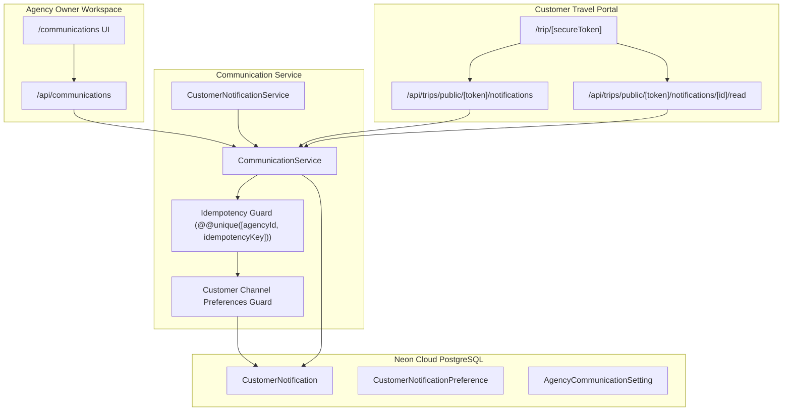

# TRIPDESK — PHASE 21-F IMPLEMENTATION REPORT
**Agency Communication Center & Customer Notification Engine**

**Date:** September 01, 2026  
**Environment:** Production-like (`localhost:3001` / Neon Cloud PostgreSQL / Supabase Auth)  
**Branch:** `phase-21`  
**Status:** **100% COMPLETE & CERTIFIED**

---

## 1. Executive Summary

Phase 21-F transforms TripDesk from a system that stores and displays operational data into an active communication platform. It delivers:
1. A multi-channel **Agency Communication Center (`/communications`)** for agency owners.
2. A **Customer Notification Engine** embedded into the secure public traveler portal (`/trip/[secureToken]`).
3. Fully isolated, tenant-scoped REST APIs for manual communication dispatch, automated event triggers, public token notifications, and delivery state tracking.
4. Comprehensive multi-tenant protection, deterministic idempotency guards, and complete commercial safety (zero supplier financial leaks).

---

## 2. Architecture & Design Principles

---

## 3. Database Schema Reusability & Integrity

No destructive database changes were performed. Phase 21-F leveraged existing PostgreSQL models:
* `CustomerNotification`: `id`, `agencyId`, `customerId`, `tripId`, `bookingId`, `quotationId`, `type`, `title`, `message`, `channel`, `status`, `recipient`, `subject`, `providerMessageId`, `failureReason`, `retryCount`, `idempotencyKey`, `linkUrl`, `readAt`, `sentAt`, `createdAt`.
* `CustomerNotificationPreference`: Per-customer opt-in switches for email, WhatsApp, SMS, and in-app alerts.
* `AgencyCommunicationSetting`: Agency-wide default toggles and sender parameters.

---

## 4. Implemented Components

### 4.1. Validation Layer (`src/lib/validation/communication-schema.ts`)
* `listCommunicationLogsSchema`: Query parameter validation with pagination and channel/status/type filters.
* `sendManualMessageSchema`: Zod schema for manual traveler messages (enforcing max 5000 character limit, required title, required customer).
* `listPublicNotificationsSchema`: Query parameter validation for public traveler token requests.
* `publicReadNotificationSchema`: Payload validation for marking notifications as read.

### 4.2. Service Layer (`src/lib/services/communication-service.ts`)
* `getCommunicationSummary(agencyId)`: Computes Total Dispatches, Delivered, Pending, Failed, and Unread counts across all channels.
* `resolveTripByToken(token)`: Securely resolves token hashes to trip, customer, and agency entities.
* `getPublicNotifications(token, query)`: Queries notifications scoped strictly to the token's trip and customer without exposing supplier financial details.
* `markPublicNotificationRead(token, notificationId)`: Updates notification delivery status to `READ` and records `readAt`.
* `sendManualMessage(agencyId, input)`: Centralized entrypoint for agency-initiated messages.
* `notifyBookingConfirmed(agencyId, bookingId)`: Automated booking confirmation dispatch.
* `notifyPaymentReceived(agencyId, paymentId)`: Automated payment receipt dispatch.

### 4.3. REST API Layer (`src/app/api/`)
* `GET /api/communications`: Scoped to authenticated Agency Owner, returns paginated logs and KPI summary scorecards.
* `POST /api/communications`: Validates and dispatches manual customer communications.
* `GET /api/communications/[id]`: Returns single communication log details.
* `GET /api/trips/public/[token]/notifications`: Public endpoint resolving customer notifications for the portal.
* `POST /api/trips/public/[token]/notifications/[id]/read`: Public endpoint marking a notification as read.

### 4.4. Client SDK (`src/lib/api-client/`)
* `communicationClient`: Standard aliases (`getCommunications`, `createCommunication`, `getCommunication`, `runAutomation`).
* `tripPublicClient`: Added `getNotifications(token, params)` and `markNotificationRead(token, notificationId)`.

### 4.5. Agency UI (`src/app/(dashboard)/communications/page.tsx`)
* 4 KPI Scorecards (Total Dispatches, Delivered & Read, Pending / Queued, Failed / Cancelled).
* Multi-filter bar (Search, Channel, Event Type, Delivery Status).
* Communication Ledger table with color-coded status badges and action modals.
* "Send Customer Message" modal with customer picker, related trip selector, channel switcher, and real-time dispatching.
* Detail inspection modal with full delivery telemetry.

### 4.6. Customer Portal UI (`src/app/trip/[secureToken]/page.tsx`)
* Top header Notification Bell button with animated unread badge.
* Interactive Popover Notification Tray.
* "Important Tour Notifications & Alerts" feed card on the main page with 1-click "Mark Read" interaction.

---

## 5. Security & Safety Invariants

1. **Strict Multi-Tenancy**: Every agency query enforces `where: { agencyId: ctx.agencyId }`.
2. **Zero Commercial Leaks**: Public notification queries strictly omit supplier costs, buy prices, profit margins, supplier payables, and internal remarks.
3. **Deterministic Idempotency**: Automated notifications utilize unique idempotency keys (`booking-conf-${id}`, `pay-rcvd-wa-${id}`) to prevent duplicate notification bursts.
4. **Token Isolation**: Public customer endpoints derive customer and agency identities solely from validated `tokenHash` values in `PublicShareLink`.
